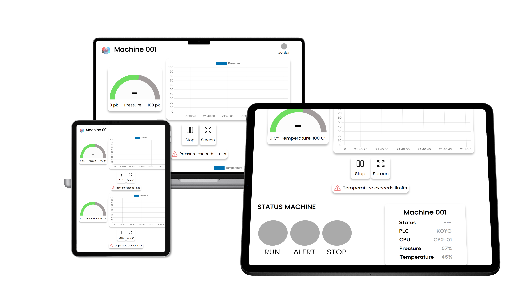

# Web App MQTT Broker Connect


Web App MQTT Broker Connect is an application that allows you to connect to an MQTT broker and display real-time data in a user interface. The application is built using HTML, CSS, JavaScript, and MQTT.js.

## Usage
To use the Web App MQTT Broker Connect, you need to install it on a server and access the corresponding URL. The application has been tested with Apache2 on Ubuntu, but it should work with other web servers as well.
1. Clone the repository to your server.
```
git clone https://github.com/j03rul4nd/uix-mqtt.git
```
2. Install Apache2 and PHP on your server if they are not already installed.
3. Copy the contents of the repository to your Apache2 document root (typically /var/www/html/).
```
sudo cp -r uix-mqtt/* /var/www/html/
```
4. Open a web browser and navigate to your server's IP address or hostname.

## Disclaimer
The use of this application is free and open, but it is important to note that the author is not responsible for any use or problems that may arise in connection with its use. It is recommended to review the code and usage instructions before implementing the application in a production environment.